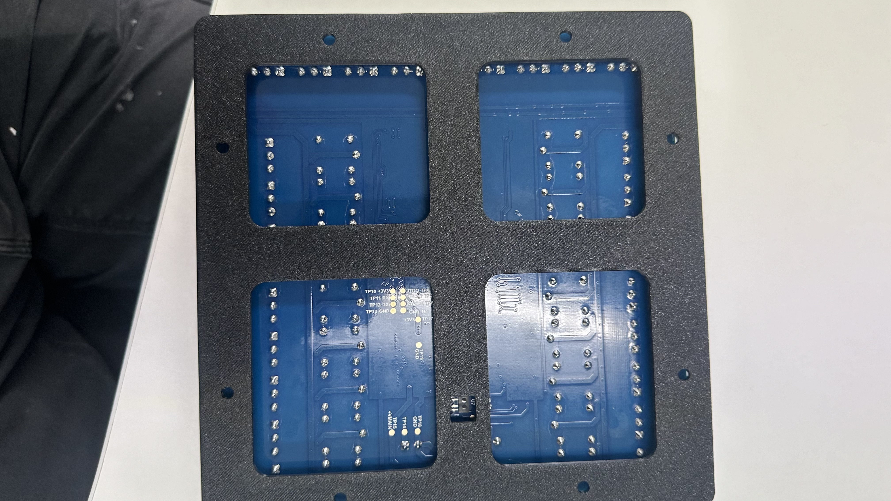
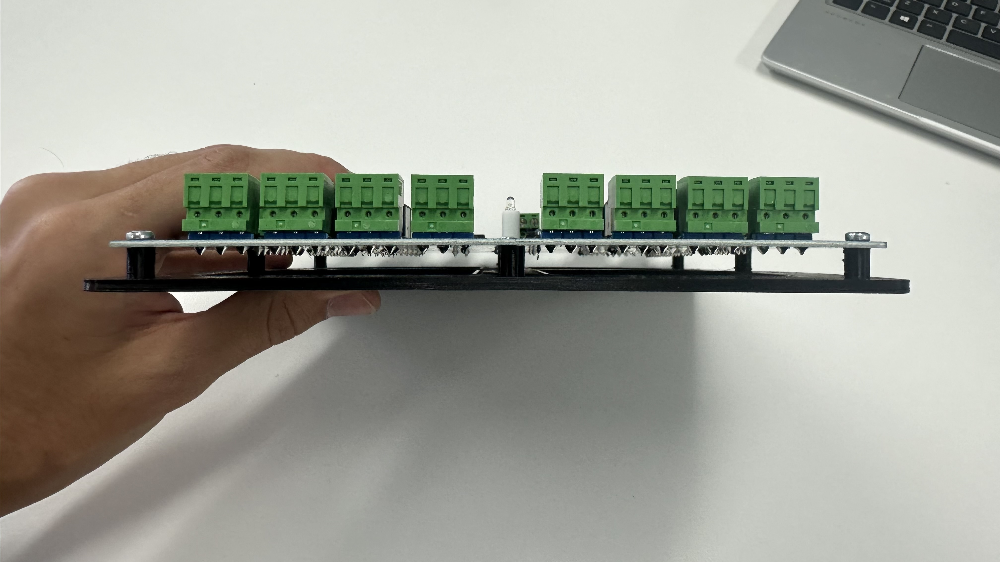

# Gallagher-Mounting-Plate
This project is an open-source 3D printable mount, suitable for Gallagher hardware. 
The following components are compatible
- Controller 7000 (with or without plugin module)
- Controller 6000 (with or without plugin module)
- Controller 3000
- HDIO (16in 16out)

